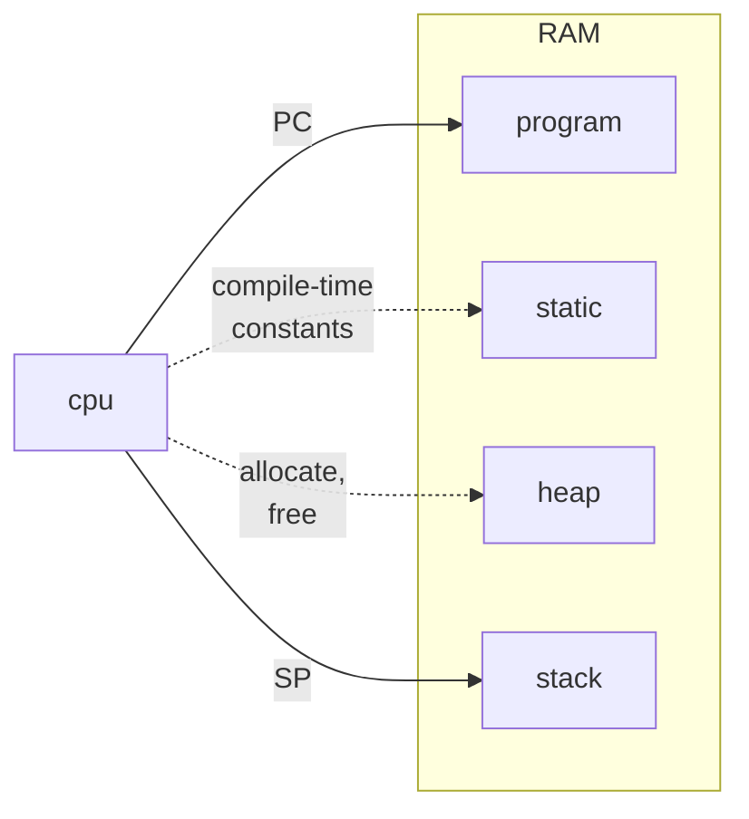

Copyright &copy; 2024 Kirk Rader

# Scheme

Various Scheme programming examples.

## Background

> ...conditionals, procedure calls, and continuations are the only control
> operations provided by Scheme. Looping is accomplished by tail-recursive
> procedure calls, and support for exception handling and “gotos” is provided
> by continuations.
>
> _Representing Control in the Presence of First-Class Continuations_, Dybvig &
> Hieb, 1990

Scheme is the programming language of which you have heard but never seen. Or
if you have seen it, you have shuddered at "all the ridiculous parentheses" and
looked away.

You have no idea what you have missed.

Just as Turing's [_a-machines_](https://en.wikipedia.org/wiki/Turing_machine)
provide the theoretical basis for all digital computing hardware, Church's
_&lambda;-calculus_ is the fundamental framework for any possible programming
language. The Lisp family of languages began in the 1960's in an attempt to
implement the &lambda;-calculus directly as a programming language. Scheme was
the ultimate result of that tradition.

If you understand what is unique about Scheme and can instinctively apply its
principles in real-world applications even in less powerful languages, you
deserve to consider yourself a truly extraordinary coder.

#### No, Really...

Consider the following formula of &lambda;-calculus:

$$
\begin{split}
    \text{let } n & = f \ 2 \\
  \text{where } f & = \lambda x . + x \ 1 \\
     \therefore n &  = 3
\end{split}
$$

The preceding would be read in English as:

> Let _n_ be _f_ of 2 where _f_ is a function that adds 1 to its argument.
> Therefore _n_ is 3.

In the terminology of formal linguistics, &lambda; is a variable-binding
operator used to define mathematical computations.

Here is the literal equivalent in just about any dialect of Lisp, including
Scheme:

```scheme
(let* ((f (lambda (x) (+ x 1)))
       (n (f 2)))
  n)
```

Pasting the preceding [sexpr](https://en.wikipedia.org/wiki/S-expression) into
a REPL (read-eval-print loop) for any Lisp environment will display 3 as the
result. Many moden Lisp environments will even accept a unicode &lambda;
character as a synonym for spelling out `lambda` in ASCII, making the
relationship to &lambda;-calculus that much more clear:

```scheme
(let* ((f (λ (x) (+ x 1)))
       (n (f 2)))
  n)
```

The differences between the &lambda;-calculus and Lisp versions are:

1. Lisp imposes a strict ordering of expressions based on a computer program's
   flow of control while human students of the philosophy of mathematics have
   far more flexible CPU architectures allowing, in this case, the use of a
   function and its definition to be evaluated in parallel

2. So many parentheses!

It is a great irony that Church was an advocate of prefix notation for
mathematical operators like $+$ (sometimes called Polish notation after the
school of mathemticians who first described and used it), in part because it
results in a more consistent syntax with other instances of function
application, but mostly because it allows for much more compact mathematical
formulas by eliminating the need for grouping symbols such as parentheses in
most circumstances.

When McCarthy first started working on what would become Lisp, he envisoned two
distinct forms of syntax. S-expressions were intended as an internal data
representation. To make them as easy to parse as possible they require almost
everything to be surrounded by parentheses. M-expressions were intended to be
used to write Lisp source code and they... were never really worked out to any
useful degree. The original intent had been to implement a language whose
source code would be much more "mainstream" by comparison to Algol-like
languages under development at the time while implementing the full flexibility
and expressive power of the &lambda;-calculus under the covers. As the first
Lisp implementation started to take shape, however, getting working
interpreters and compilers going based on S-expressions proved easier than
getting consensus on what kind of syntax M-expressions should have, so the
first generation of Lisp programmers just embraced S-expressions as the
"official" syntax for Lisp source code and the whole idea of M-expression based
syntax just fizzled out.

Had M-expressions been fully realized and adopted, the Lisp family of languages
would no doubt have ended up with a syntax looking much more familiar to
developers used to popular languages in the Pascal, Modula, Ada, C, C++. Java,
C#, JavaScript, Go tradition. The lack of enthusiasm for M-expressions was
partly due to the fact that, in reality, "so many parentheses" turns out only
to be a deterrent to beginners. Anyone who spends even a short time seriously
attempting to write Lisp quickly becomes quite used to them. Further, since
sexprs are represented using the core data structure type (originally, the
_only_ type of structured data) supported by Lisp, representing Lisp programs
as sexprs means that every Lisp program is also a chunk of data that can be
easily parsed, modified and written using built-in `read`, `print` and list
manipulation functions. I.e. writing Lisp code that analyses, modifies or
generates Lisp code is straightforward. This is one of the characteristics that
made Lisp the overwhelmingly preferred language for the first wave of AI
research and development from the beginning of the 1960's through the end of
the 1980's.

That said, many attempts have been made over the subsequent decades to wrap
Lisp's incredibly powerful semantics in syntax that is more palatable to
developers coming to it from Algol-like languages. Smalltalk and Haskell were
early examples. Ruby is the most widely-adopted. Clojure is a weird Java/Lisp
love child. All come with baggage of one kind or another such that if you want
to really understand how the world of software engineers came to use the word
"lambda" to mean "function" -- without having ever heard of Computability
Theory -- and all that the functional programming paradigm has to offer, just
put your aversion to "all those silly parentheses" aside (presumably by
learning why you should not try to write Lisp source code in any editor other
than [Emacs](https://www.gnu.org/software/emacs/)) and learn Lisp, starting
with Scheme.

#### Scheme is the RISC of Lisps

Scheme can famously be shown to be "Turing complete" -- i.e. capable of
representing the behavior of any possible _a-machine_ -- using only a tiny
handful of built-in data types and expression-defining special forms like
`cons`, `first`, `rest`, `if` and, critically, `lambda` and `call/cc` in lieu
of a dramatically larger number of keywords and special forms to represent
things like loops and various kinds of special case processing in each
iteration.

Replacing special-purpose flow-of-control constructs by first-class
continuations and tail-recursion provides benefits similar to those of a RISC
CPU architecture compared to CISC. You may be able to express a given algorithm
in the assembly language of a CISC machine using fewer individual instructions
than the equivalent logic for a RISC machine. But each RISC instruction
executes faster and their simpler, more "decomposed" semantics provide more
opportunities for optimization compared to a "one size fits all" set of
higher-level semantics. It is also easier to prove the correctness or predict
the performance of programs that are composed of smaller, more consistent
semantic building blocks.

Or, at any rate, it _can_ and _should_ be so. Over the years, most Scheme
implementers have succumbed to pressure from programmers familar with
"mainstream" languages to support more and more non-Scheme-like idioms -- no
doubt in an ultimately self-defeating bid to make Scheme adoption more
enticing. If you are intrigued by Scheme but find yourself irrestibly drawn to
forms like `do`, `for` etc., then perhaps you should consider whether or not
Scheme actually fits your preferred coding style or use case. If you remain
convinced that Scheme is for you, than "just say no" to `do`, `for` etc!

## Tail Call Optimization

These examples include a number of definitions of the factorial ($!$) function,
collectively demonstrating that, in Scheme, looping is logically equivalent to
self-recursion in tail position. When combined with [first class
continuations](#first-class-continuations), this makes Continuation Passing
Style [CPS](#continuation-passing-style) available as a design paradigm at the
application level.

### [factorial1.scm](./factorial1.scm)

In particular, [factorial1.scm](./factorial1.scm) literally implements the
traditional definition of $n!$:

$$
n! =
\begin{cases}
                        1 & \text{if } n \leq 1 \\
  n (n - 1)! & \text{otherwise}
\end{cases}
$$

in a manner susceptible to stack overflow, just as for any similar
self-recursive implementation of $n!$ in any other programming language.

```scheme
;; NOT the way to implement n! in scheme (or any other programming language)
(define (factorial1 n)
  (if (<= n 1)
      1
      (* n (factorial1 (- n 1)))))
```

### [factorial2.scm](./factorial2.scm)

On the first of several other hands, [factorial2.scm](./factorial2.scm) avoids
the stack overflow issue using the `do` looping special form introduced into
later versions of Scheme, modeled on the same form from other Lisp dialects.
This is exactly how $n!$ should be implemented in any procedural programming
language lacking tail-call optimization.

```scheme
;; another way NOT to define n! in scheme (even though it is the only way to
;; do so in most programming languages)
(define (factorial2 n)
  (let ((a 1))
    (do ((x n (- x 1)))
        ((<= x 1) a)
      (set! a (* a x)))))
```

While the [factorial2.scm](./factorial2.scm) version works, it is not
considered good Scheme style, not least because the Scheme compiler will
transform it under the covers into something fairly closely resembling the
version in [factorial3.scm](./factorial3.scm) in any case. So why defer such
optimizations to the compiler when applying them yourself results in code that
is easier to write, read and maintain?

### [factorial3.scm](./factorial3.scm)

The version in [factorial3.scm](./factorial3.scm) implements this
mathematically equivalent variation of the traditional definition of $n!$:

$$
n! = f(n, 1) \\
\text{where } f(x, a) =
\begin{cases}
         a & \text{if } x \leq 1 \\
f(x-1, ax) & \text{otherwise}
\end{cases}
$$

In particular, it introduces a helper function, `f`, that implements
effectively the same self-recursive logic as in
[factorial1.scm](./factorial1.scm) but places the self-call in _tail position_.

<details>

<summary><b>Tail calls</b></summary>

---

To really understand the meaning of the term "tail call" or what it means for a
call to be in "tail position" you must understand _continuations_, discussed
below. Suffice it to say here that a call is in "tail position" if the call is
the last thing the calling function does such that whatever the call returns
becomes the value of the caller without further access or manipulation by the
caller.

In the case of [factorial1.scm](./factorial1.scm) vs
[factorial3.scm](./factorial3.scm), the self-call in the former is _not_ in
tail position because first `factorial1` calls itself, then it multiplies the
returned value by its own parameter before returning. This requires the use of
a distinct _stack frame_ at each level in the calling hierarchy to keep track
of both the caller's state and the value returned from the self-call.

The self-call to `f` in `factorial3` _is_ in tail position because `f` performs
the necessary multiplication before calling itself, passing the new accumulated
result along at each invocation and without accessing the return value from the
self-call before returning. The self-call can effectively co-opt the caller's
existing stack frame rather than needing a new frame of its own. [More on this
[later](#stack-frames-tail-calls-and-continuations).]

Note that this requires support from any intermediate forms in a calling
sequence. In particular, almost every self-call needs to be wrapped in an `if`
or similar conditional construct in order to prevent infinite loops. Most
built-in special forms in Scheme are implemented such that if they appear in
tail position so will their subordinate clauses. Thus, the self-call to `f` is
in tail position not only relative to the definition of `f`, itself, but it is
also in tail position relative to `factorial3` as a whole.

The same applies to most built-in control-flow forms such as `begin`, `cond`,
`when` `unless` etc. For forms with multiple subforms that are executed in
sequence, only the last subform is in tail position:

```scheme
;; only the last form in the body of begin, let etc. is in tail position
(let ((n (not-tail-position)))
  (also-not-tail-position)
  (tail-position))

;; both branches of an if are in tail postion, but the test expression is not
(if (not-tail-position)
  (tail-position)
  (also-tail-position))

;; the last form in each clause of a cond is in tail position
(cond

  ((not-tail-position)
   (also-not-tail-postion)
   (tail-position))

  ((again-not-tail-position)
   (also-tail-position))
   
   (else
    (once-again-not-tail-position)
    (once-again-tail-position)))
```

...and so on.

---

</details>

The Scheme specification requires that the compiler detect such tail-calls and
optimize them in such a way that the resulting code is at least (if not more)
efficient than the code emitted for an equivalent `do` or `for` loop, without
growing the stack. So [factorial3.scm](./factorial3.scm) has all of the same
performance and memory optimizations as [factorial2.scm](./factorial2.scm), but
with [CPS](#continuation-passing-style) based optimizations pre-applied at the
source-code level.

```scheme
;; a way to define n! (but not the best way)
(define (factorial3 n)
  (letrec ((f (lambda (x a)
                (if (<= x 1)
                    a
                    (f (- x 1) (* a x))))))
    (f n 1)))
```

But wait! There's more!

### [factorial4.scm](./factorial4.scm)

Finally, [factorial4.scm](./factorial4.scm) implements 100% identical logic to
[factorial3.scm](./factorial3.scm) but using a named `let` to make the code
more readable. In fact, the version in [factorial4.scm](./factorial4.scm) is
highly reminiscent of that in [factorial1.scm](./factorial1.scm), making it
quite obvious that the two functions are mathematically equivalent, while still
avoiding the potential for stack overlows.

```scheme
;; the idiomatic way to implement n! in scheme
(define (factorial4 n)
  (let f ((x n)
          (a 1))
    (if (<= x 1)
        a
        (f (- x 1) (* a x)))))
```

Even though [factorial2](./factorial2.scm) will seem much more intuitive at
first glance than [factorial3](./factorial3.scm) or
[factorial4](./factorial4.scm) to programmers coming to Scheme from other
languages (even other Lisp dialects), Scheme was designed from the ground up to
support self-recursion in tail position as the natural way to implement
iteration. The original authors of the first version of Scheme coined the term
[CPS](#continuation-passing-style) to describe one of their motivations for
creating what was, at the time, yet another Lisp dialect (back when dialects of
Lisp were as common as dirt).

[CPS](#continuation-passing-style) is so powerful that it has become a staple
of compiler design for many programming languages even though only a precious
few languages extend its benefits to application-level code in the manner of
Scheme.

Which brings us to...

## First Class Continuations

Along with [tail call optimization](#tail-call-optimization), first-class
continuations are what make a genuine [CPS](#continuation-passing-style)
possible in application-level code. The continuation of a procedure is simply
the code which receives that procedure's return value and uses it in some
subsequent computation. The exact code representing the direct continuation of
any given statement in any given programming language is usually implicit code
generated by the compiler, with application-level code invoked along the way in
a fairly modular (from the compiler's point of view) way.

<details>

<summary><b>Diving deep into the flow of control...</b></summary>

---

For example, typing the following in a Scheme REPL (read-eval-print loop):

```scheme
(let ((x 1))
  (+ x 2))
```

produces the output:

```
3
```

because:

- The continuation of the evaluation of the self-instantiating constant 1 is
  code created by the Scheme JIT compiler or interpreter that binds the
  variable `x` to its initial value

- The continuation of that variable-binding code is only indirectly the
  invocation of the built-in `+` function
  
- Under the covers, each of the arguments to `+` are evaluated in the order
  written and the continuation of _those_ evaluations is the application of `+`

- Specifically, the direct continuation of the code that binds `x` to its
  initial value is yet more implicitly generated code which:

  - Performs the evaluation of the variable `x` to obtain its value
  
  - Evaluates the self-instantiating constant 2
  
  - The call stack is used to preserve the intermediate states of these
    evaluations, making them available to the invocation of `+`. (This is why
    only calls in tail position can benefit from [tail-call
    optimization](#tail-call-optimization))

- The continuation of performing those two intermediate evaluations is the
  invocation of `+`, retrieving the parameter values from the stack

- The continuation of `+` would be the next form in the body of `let`, if there
  were any

- Since there are not, the invocation of `+` is in tail position and so its
  continuation becomes simply that of the whole `let` form

- That continuation in our example is the REPL, which implicitly executes code
  to print 3 to `stdout`

As shown by the preceding discussion, the order in which expressions are
evaluated and how expressions' values are passed to their continuations is
dependent on the syntax and semantics of a given programming language. The
common term for the rules for selecting the order of expression evaluation and
continuation invocation is "flow of control." In order to be useful, any
programming language must include some number of special forms for declaring
non-sequential flow of control.

Such special forms not only include simple conditionals like `if` but in most
languages also include looping constructs like `for`, `do`, `while` etc. as
well as statements like `return`, `break`, `continue` and so on to handle
special-but-not-uncommon corner cases.

---

</details>

Scheme takes an approach different from nearly any other language by allowing
application-level code to explicitly "capture" a procedure's continuation at
any point and use it to construct application-specific flows-of-control. This
turns out to be so powerful that the earliest versions of Scheme provided only
a vary basic set of conditional forms and relied on application code using
tail-recursion and continuations for any non-sequential flow fancier than `if`,
as stated in the quote from Scheme's original authors [near the top of this
page](#background).

Doing so allows Scheme to minimize the number of distinct flow-of-control
related special forms it defines while maximizing Scheme's ability to express
any conceivable flow-of-control. This is a good thing because it means that
there are fewer potential "gotchas" lurking within the implementation of
deceptively simple-looking constructs. Consider the semantics of the many
variants of the `for` statement in languages like JavaScript or Go -- not to
mention the ugliness of Go's "labeled" `break` and `continue` statements -- all
of which are required because most languages do not provide direct access to an
executing program's current continuation as a first-class data type.

Scheme does.

<details>

<summary><code>call/cc</code></summary>

---

The "official" name for the special form that captures an executing procedure's
continuation is `call-with-current-continuation`. But the Scheme specification
defines `call/cc` as an alias for `call-with-current-continuation` to ease
typing. These examples use `call/cc` throughout.

---

</details>

### [return-early.scm](./return-early.scm)

Given the following definition of `return-early`:

```scheme
;; return-early demonstrates a basic use for continuations: implement
;; the "return" statement common in many other languages
(define (return-early)
  (call/cc
   (lambda (return)

     ;; return is bound to call/cc's continuation, which is in tail
     ;; position relative to return-early

     (displayln 1)

     ;; invoking return causes return-early's continuation to
     ;; immediately receive 2 as its value
     (return 2)

     ;; execution never reaches here because of the invocation of the
     ;; return continuation in the preceding line
     (displayln 3))))
```

Excuting the following in a REPL will result in:

```
> (return-early)
1
2
```

This is because 1 is the output from the first line in the body of the
`lambda`,i.e. `(displayln 1)`, and the result of the whole `call/cc` invocation
is 2, due to the use of the continuation in the second line in the `lambda`
body, `(return 2)`.

There will be no trace of 3 in the output, because the use of the `return`
continuation causes the whole `call/cc` form to exit before reaching
`(displayln 3)`. This is why Scheme has no explicit `return` or `break`
statements comparable to other languages. Just use `call/cc` instead.

### [return-resume.scm](./return-resume.scm)

There is far more to Scheme's first-class continuations than as a verbose
version of `return` or `break`. Continuations are procedures and procedures are
lexical closures. They can not only be bound to local variables using
`call/cc`, but they can be returned as values and passed as parameters to other
procedures. When such a procedure is invoked it transfers control back to the
point in the code for which it is the continuation while "reanimating" the
previously  exited lexcial environment in which it was created. If such an
invocation is made to and from tail position, this hand-off of control from
procedure to procedure can continue indefinitely without danger of stack
overlow, world without end... and that is the essence of
[CPS](#continuation-passing-style). Before going there, here is how the
[return-early](./return-early.scm) example can be extended to demonstrate a
basic kind of resumable exception handling:

```scheme
;; return-resume demonstrates using a continuation to resume a
;; previously exited flow-of-control
(define (return-resume)
  (call/cc
   (lambda (return)

     ;; return is bound call/cc's continuation, which is in tail
     ;; position relative to return-resume

     (displayln 1)

     ;; invoking return causes return-early's continuation to
     ;; immediately receive the resume continuation as its value
     (let ((resumed (call/cc (lambda (resume) (return resume)))))

       ;; execution only reaches here if the resume continuation is
       ;; invoked in which case resumed is bound to whatever was
       ;; passed to it
       (displayln resumed)

       ;; return 2 as the "final" value of return-resume
       (return 2)))))
```

Here is what it looks like to invoke `return-resume` in a REPL:

```
> (define k (return-resume))
1
> (k 'foo)
foo
> k
2
```

- The initial invocation of `return-resume` displays 1 as a side-effect, as in
  the preceding `return-early` example

- It then invokes `call/cc` internally to bind `resume` to another
  continuation, this time as the expression being bound in a `let`

  - The evaluation of that expression passes the `resume` continuation to the
    `return` continuation

  - The net result is that `return-resume` immediately returns, just as in the
    `return-early` example, but this time with the `resume` continuation as the
    value passed to `return-resume`'s continuation

- The `resume` continuation ends up being set as the initial value for a global
  binding of `k`

- Passing `'foo` to `k` causes the interrupted invocation of `return-resume` to
  resume, completing the binding of `resumed` to the symbol `foo`

- The body of the reanimated `let` then prints the value of `resumed` as a
  side-effect and then returns the value 2

- This causes `return-resume` original continuation to _return a second time_,
  updating the value of the global variable `k` to 2

Understanding the last bullet point is essential.

### [return-resumable.scm](./return-resumable.scm)

Any non-trivial use of continuation ends up looking like some kind of
iteration, even when no explicit looping construct or self-recursion is
involved. Consider this function, which builds on
[return-resume](./return-resume.scm):

```scheme
;; return-resumable demonstrates using a continuation to resume a
;; previously exited flow-of-control multiple times
(define (return-resumable)
  (let ((counter 0))
    (lambda ()
      (call/cc
       (lambda (return)

         ;; return is bound call/cc's continuation, which is in tail
         ;; position relative to return-resume

         (printf "initial value of counter: ~a~%" counter)

         ;; invoking return causes return-early's continuation to
         ;; immediately receive the resume continuation as its value
         (let ((resumed (call/cc (lambda (resume) (return resume)))))

           ;; execution only reaches here if the resume continuation is
           ;; invoked in which case resumed is bound to whatever was
           ;; passed to it

           (set! counter (+ counter 1))
           (printf "resumed with ~a, counter is now ~a~%" resumed counter)

           ;; return counter as the "final" value of return-resume
           (return counter)))))))
```

Here is what happens when the initial continuation returned by a function
created by `return-resumable` is invoked multiple times:

```
> (define resumable (return-resumable))
> (define c (resumable))
initial value of counter: 0
> (define k c)
> (k 'foo)
resumed with foo, counter is now 1
> (k 'bar)
resumed with bar, counter is now 2
> (k 'baz)
resumed with baz, counter is now 3
> c
3
```

- Bind the global variable `resumable` to the result of calling
  `return-resumable`

  - This sets `resumable` to a closure where the closed-over environment has
    `counter` bound to 0 but the closure's function has not yet been invoked

- Bind the global variable `c` to the result of calling `resumable`

  - Displays the side-effect of the initial invocation of the closure

  - Sets the initial value of `c` to the closure's `resume` continuation

- Save the continuation bound to `c` in the global variable `k` since `c` will
  get overwritten each time `k` is invoked

- Invoke the continuation in `k` multiple times

  - The same side-effect message is displayed each time, reflecting the value
    bound to `resumed` and the current value of `c` for that "iteration"

- Show that `c` is also updated each time to refect each iteration's "final"
  result

### [dynamic-wind.scm](./dynamic-wind.scm)

Any language which supports the ability to exit early from the body of a
computation -- even by way of a humble `return` statement -- requires the
ability for a programmer to declare that some specific clean-up code must be
executed during a process referred to as "stack unwinding." Common Lisp
provides the `unwind-protect` special form. Numerous languages provide
variations of `try ... finally ...` code blocks. Ruby provides `ensure`. Go
provides `defer`. And so on. All of these share the feature of allowing a
programmer to arrange that a particular block of code will be executed whenever
and however a given execution context is exited.

As demonstrated by [return-resume.scm](./return-resume.scm) and
[return-resumable](./return-resumable.scm), first-class continuations up the
ante by not only allowing an execution context to exit "prematurely" but also
allowing such previously exited contexts to be re-entered. Scheme's equivalent
of `unwind-protect` is called `dynamic-wind`, and it provides the ability to
declare that a particular function must always be called before a given
execution context is entered and another function must always be called after
the protected context, no matter how many times and in what ways the protected
execution boundary is crossed.

[dynamic-wind.scm](./dynamic-wind.scm) contains two functions:

1. `continuation-demo` wraps a closure created by
   [return-resumable](./return-resumable.scm) in an invocation of
   `dynamic-wind`

2. `test` invokes `continuation-demo` multiple times

```scheme
;;;;;;;;;;;;;;;;;;;;;;;;;;;;;;;;;;;;;;;;;;;;;;;;;;;;;;;;;;;;;;;;;;;;;;;;;;;;;;;;
;; wrap a continuation created using ./return-resumable.scm in stack
;; winding / unwinding protection
(define (continuation-demo)

  (let ((resumable (return-resumable)))

    (dynamic-wind

      ;; the "before" thunk is invoked each time execution enters the
      ;; protected dynamic context
      (lambda () (printf "~%entering protected context~%"))

      ;; the "body" thunk is executed after the "before" thunk has
      ;; returned and before the "after" thunk is invoked, each time
      ;; execution enters or leaves the body of this call to
      ;; dynamic-wind
      resumable

      ;; the "after" thunk is invoked each time execution leaves the
      ;; protected dynamic context
      (lambda () (printf "exiting protected context~%")))))

;;;;;;;;;;;;;;;;;;;;;;;;;;;;;;;;;;;;;;;;;;;;;;;;;;;;;;;;;;;;;;;;;;;;;;;;;;;;;;;;
;; put all of the preceding togehter; this will write the following to
;; stdout:
;;
;;   entering protected context
;;   count is 0
;;   exiting protected context
;;
;;   entering protected context
;;   resumed with foo, count is now 1
;;   exiting protected context
;;
;;   entering protected context
;;   resumed with bar, count is now 2
;;   exiting protected context
;;
;;   entering protected context
;;   resumed with baz, count is now 3
;;   exiting protected context
;;   3
(define (test)

  ;; bind k outside of the continuation of the definition of c
  (let ((k #f))

    ;; bind c to the value returned by invoking (continuation-demo);
    ;; i.e. c will initially be bound to the continuation named resume
    ;; in the body of return-resumable
    (let ((c (continuation-demo)))

      ;; execution will enter the body of this let multiple times
      ;; despite the lack of an explicit looping construct since
      ;; invocation of an inner continuation within the body of its
      ;; outer continuation amounts to self-recursion

      (cond ((procedure? c)
             (set! k c)
             (k 'foo))

            ((= c 1)
             (k 'bar))

            ((= c 2)
             (k 'baz))

            (else
             ;; the final result returned by (test) is 3
             c)))))
```

Invoking `test` in a REPL results in:

```
> (test)

entering protected context
initial value of counter: 0
exiting protected context

entering protected context
resumed with foo, counter is now 1
exiting protected context

entering protected context
resumed with bar, counter is now 2
exiting protected context

entering protected context
resumed with baz, counter is now 3
exiting protected context
3
```

As can be seen from the output, each output from invoking the `resume`
continuation is bracked by output from the before and after thunks passed to
`dynamic-wind`. This is the last of the building blocks necessary to understand
CPS.

## Continuation Passing Style

CPS has become a staple of compiler design for many programming languages. As
already noted, that term was coined by the original authors of Scheme. The
combination of tail-call optimization and first-class continuations makes
Scheme an ideal programming language not only to experiment with new
programming languages and compilation strategies, but for implementing complex
application code for any purpose, built from a small number of provably correct
semantic building blocks.

### [engines.scm](./engines.scm)

For example, [engines.scm](./engines.scm) is an adaptation of Dybvig and Hieb's
classic paper, _Engines from Continuations_ using a slightly more modern
version of Scheme. The _make-engine_, _engine-block_ and _engine-return_ family
of procedures provides a model for cooperative multi-tasking out of which many
kinds of co-routines could easily be built without the need for special
compiler syntax and runtime support along the lines of the `go` statement in
the Go programming language.

<details>

<summary>Concurrency vs Parallel Execution</summary>

---

The discussion of using first-class continuations to implement non-trivial,
non-sequential, application-specific flows of control references only features
of "classic" Scheme before any dialects evolved that include built in support
for OS-level threads, i.e. true parallelism. One nice feature of
continuation-based co-operative multi-tasking is that task synchronization
points are fairly course grained compared to parallel thread execution and are
entirely visible at the level of the application code, itself. But note: this
does _not_ imply that there are no opportunities to shoot yourself in the foot
through careless access to shared state between continuations that were created
in a common lexical environment, especially when using a Scheme implementation
with built-in support for true parallel execution. Consider yourself warned!

---

</details>

[engines.scm](./engines.scm) defines four global procedures,
`decrement-timer!`, `make-engine`, `engine-block` and `engine-return` within a
lexical scope where they share a number of state variables and helper
procedures common to them all but private to themselves as a tightly coupled
group. This is the functional programming equivalent of visibility constraints
like `private`, `protected`, `friend` etc. in object-oriented programming
systems.

| Procedure          | Description                                                                                                |
|--------------------|------------------------------------------------------------------------------------------------------------|
| `make-engine`      | Create an _engine_ from a _thunk_, as described below                                                      |
| `engine-return`    | Allow a running engine to signal that it has completed exection                                            |
| `engine-block`     | Allow a running engine to voluntarily yield its remaining fuel but without signaling that it has completed |
| `decrement-timer!` | Allow a running engine to periodically consume an increment of "fuel." as described below                  |

- A _thunk_ is any procedure that takes no arguments

- An _engine_ is a procedure that takes three arguments:

  - `fuel` is a number of timer _ticks_ the engine is allocated when it is
    started

  - `return` is the engine's continuation, if it completes before running
    out of fuel

  - `expire` is a procedure to call if an engine runs out of fuel before
    completing

- The `return` continuation is passed two arguments:

  - The engine's value
  
  - The amount of remaining, unconsumed fuel
  
- The `expire` handler is passed a new engine that is the continuation of the
  one that expired

- Thunks passed to `make-engine`:

  - Must call `decrement-timer!` from time to time in order consume fuel

  - May call `engine-block` to voluntarily yield control to some other engine
    without completing

  - May call `engine-return` to explicitly signal that it has completed

  - Return normally, which implicitly invokes `engine-return` (this is an
    enhancement to the original Dybvig & Hieb version)

- Thunks which fail to call `decrement-timer!` or `engine-block` will block
  other engines from running until they return

Given the seeming complexity of the interdependence of the four engine-related
procedures, it is perhaps surprising how relatively little code it takes to
implement them using finrst-class continuations:

```scheme
(define decrement-timer! #f)
(define make-engine #f)
(define engine-block #f)
(define engine-return #f)

(letrec ((active? #f)
         (do-return #f)
         (do-expire #f)
         (clock 0)
         (handler '())
         (timer-handler
          (lambda ()
            (start-timer! (call/cc do-expire) timer-handler)))
         (start-timer!
          (lambda (ticks new-handler)
            (set! handler new-handler)
            (set! clock ticks)))
         (stop-timer!
          (lambda ()
            (let ((remaining clock))
              (set! clock 0)
              (set! handler '())
              remaining)))
         (new-engine
          (lambda (resume)
            (lambda (ticks return expire)
              (if active?
                  (error 'engine "attempt to nest engines")
                  (set! active? #t))
              ((call/cc
                (lambda (escape)
                  (set! do-return
                        (lambda (value ticks)
                          (set! active? #f)
                          (escape (lambda () (return value ticks)))))
                  (set! do-expire
                        (lambda (resume)
                          (set! active? #f)
                          (escape (lambda () (expire (new-engine resume))))))
                  (resume ticks))))))))

  (set! decrement-timer!
        (lambda ()
          (when (> clock 0)
            (set! clock (- clock 1))
            (when (< clock 1)
              (let ((h handler))
                (stop-timer!)
                (h))))))

  (set! make-engine
        (lambda (thunk)
          (new-engine
           (lambda (ticks)
             (start-timer! ticks timer-handler)
             (engine-return (thunk))))))

  (set! engine-block
        (lambda ()
          (call/cc (lambda (resume) (do-expire)))))

  (set! engine-return
        (lambda (value)
          (if active?
              (let ((ticks (stop-timer!)))
                (do-return value ticks))
              (error 'engine "no engine running")))))
```

<details>

<summary><b><i>goroutines</i> are like engines</b></summary>

---

Engines represent a 100% cooperative paradigm for multi-tasking. There is no
overarching engine scheduler and no mechanism for forcing one engine to yield
to another. This may seem highly restrictive to developers familiar with
preemptive multi-tasking operating systems and multi-core CPU's running
multiple thread in parallel. But note that there is nothing unusual about
cooperative multi-tasking. The first few decades of the digital revolution took
place using hardware and operating systems that almost 100% single tasking. The
first version of the Macintosh operating system, circa 1984, was considered
quite advanced for a desktop OS in that it ran a multi-tasking operating system
driven by an "event loop" which, at the end of the day, worked much like the
engines implemented by the preceding example. (Pre-unix generations of Macs
were notoriously prone to having to be forcibly rebooted due to one misbhaving
program failing to yield to any others.)

For a more recent example, the Go programming language is considered quite _au
courant_. It takes its name from its distinctive `go` statement for launching
so-called _goroutines_ that interoperate using _channels_... which, again, are
ultimately a co-operative multi-tasking system lacking any centralized
scheduling or preemption mechanism. In fact, it would be quite straightforward
to extend the implementation of engines shown above such that instead of some
amount of "fuel" that is consulting using a procedure like `decrement-timer!`,
tasks yielded to one another by sharing some kind of synchronization or
communication object at which point they would semantically identical to
_goroutines_.

[Note: I might have summarized this section as "engines are like _goroutines_",
since the latter are more famous and popular these days except for the simple
fact that the preceding implementation of engines predated the invention of
_groutines_ by decades. In fact, I suspect the developers who first designed Go
were just as well aware of Dybvig's and Hieb's work as they obviously were of
Kernighan's and Ritchie's and many other programming language pioneers of the
70's and 80's, given how much of a throw-back it is to such OG paradigms.]

---

</details>

### [engines-test.scm](./engines-test.scm)

Putting all of the above together, [engines-test.scm](./engines-test.scm)
provides an example of using engines which also functions as a basic unit test.
It defines a macro, `concurrent-or`, which whose behavior is like the built-in
`or` operator except that it uses engines to interleave evaluation of its
parameters.

The normal `or` operator is such that the following will never complete:

```scheme
(or (let loop () (loop)) #t)
```

because `or` does not attempt to evaluate `#t`, in this case, until `(let loop
() (loop))` completes which, of course, it never will. The following, however,
will return `#t`:

```scheme
(concurrent-or (let loop () (decrement-timer!) (loop)) #t)
```

given the definition of `concurrent-or` in
[engines-test.scm](./engines-test.scm). This works because `concurrent-or`
wraps each parameters as the body of a thunk and passes them to an invocation
of `first-true`. The latter invokes each thunk as an engine whose expire
routine invokes the continuation of the next in a round-robin fashion. So long
as all the thunks call `decrement-timer!` inside any inner loops,
`concurrent-or` will eventually return if any of the engines return a value
other than `#f` or all of them complete, whichever happens first.

<details>

<summary><b>Calling <code>decrement-timer!</code></b></summary>

---

Dybvig and Hieb's original version assumed the use of a mechanism like "apply
hooks" to implicitly call `decrement-timer!`, making any thunk a potential
candidate for use as an engine in use cases like `concurrent-or`, not just
well-behaved ones that explicitly call `decrement-timer!`. This was safe for
them to do since they were the implementers of the original versions of Scheme
and could tweak its runtime at will. More modern versions of Scheme have very
inconsistent features for this kind of "meta programming." Rather than create
examples that were tightly coupled to some particular Scheme variant or other,
I chose to leave out any such attempt. The consequence is that my
`concurrent-or` is less robust than D&H's original `parallel-or`.

---

</details>

```scheme
(define first-true #f)

;; Macro: (concurrent-or ...)
;;
;; Like (or ...) except that it will return if even one expression
;; returns a value other than #f, even if one or more expressions
;; never return.
;;
;; See: first-true
(define-syntax concurrent-or
  (syntax-rules ()
    ((_ e ...)
     (first-true (lambda () e) ...))))

;; Unit test for engines.
;;
;; Invoke concurrent-or on two expressions, the first of which never
;; returns.
;;
;; count - the argument to pass to finite-loop (q.v.)
(define (engines-test count)
  (letrec ((infinite-loop-count 0)
           (finite-loop-count 0)
           (infinite-loop
            (lambda ()
              (decrement-timer!)
              (set! infinite-loop-count
                    (+ infinite-loop-count 1))
              (display "infinite loop")
              (newline)
              (infinite-loop)))
           (finite-loop
            (lambda (count)
              (decrement-timer!)
              (set! finite-loop-count
                    (+ finite-loop-count 1))
              (if (> count 0)
                  (begin
                    (display "finite loop count ")
                    (display count)
                    (newline)
                    (finite-loop (- count 1)))
                  (begin
                    (display "infinite-loop-count ")
                    (display infinite-loop-count)
                    (newline)
                    (display "finite-loop-count ")
                    (display finite-loop-count)
                    (newline)
                    #t)))))
    (concurrent-or
     (infinite-loop)
     (finite-loop count))))

(let ((make-queue
       (lambda ()
         (let ((front '())
               (back '()))

           (lambda (message . arguments)

             (case message

               ((enqueue)
                (when (null? arguments)
                  (error 'queue "missing argument to push"))
                (set! back (cons (car arguments) back)))

               ((dequeue)
                (when (null? front)
                  (set! front (reverse back))
                  (set! back '()))
                (when (null? front)
                  (error 'queue "empty queue"))
                (let ((value (car front)))
                  (set! front (cdr front))
                  value))

               ((empty?)
                (and (null? front) (null? back)))

               (else
                (error 'queue "unsupported message" message))))))))

  ;; Function: (first-true . thunks)
  ;;
  ;; Return the value of the first of the given procedures to return a
  ;; value other than #f or #f if all of the procedures terminate with
  ;; the value #f.
  ;;
  ;; Uses engines to interleave execution of the given procedures such
  ;; that first-true will return if at least one of the procedures
  ;; returns a value other then #f even if one or more of the procedures
  ;; never returns.
  ;;
  ;; As with make-engine and engine-return, this is adapted from Dybvig
  ;; and Hieb, "Engines from Continuations" [1988]. It serves as a unit
  ;; test for engines. Note that this demonstrates the power of engines
  ;; to implement an extremely light-weight co-operative multi-tasking
  ;; mechanism in pure Scheme.
  ;;
  ;; See: make-engine, concurrent-or
  (set! first-true
        (lambda thunks
          (letrec ((engines
                    ;; FIFO queue of engines to run
                    (make-queue))
                   (run
                    ;; execute each engine in the queue, removing engines that
                    ;; terminate, re-enqueueing ones that expire, until one
                    ;; returns a value other than #f
                    (lambda ()
                      (if (engines 'empty?)
                          #f
                          (let ((engine (engines 'dequeue)))
                            (engine
                             1
                             (lambda (result ticks) (or result (run)))
                             (lambda (engine) (engines 'enqueue engine) (run))))))))
            (for-each (lambda (thunk)
                        (engines 'enqueue (make-engine thunk)))
                      thunks)
            (run)))))
```

## Stack Frames, Tail Calls and Continuations

To really understand [CPS](#continuation-passing-style), you must understand
the design of stored-program computing devices and the memory model used by
CPU's and operating systems. Note that the following discussion deliberately
ellides the many optimizations (and their concomittant complications) that have
evolved over the decades since Von Neumann et al. first described their work on
EDVAC in the 1940's (from which the misleading term "Von Neumann architecture"
is derived). In particular, in order to keep the discussion as clear and
focused as possible, the following deliberately makes no reference to things
like separate control and data buses to support caching, per-process or
per-thread stacks or heaps, and so on.

The basic paradigm assumed by the Scheme runtime is based on a few basic
principles common to all widely used digitial computing devices:

- A CPU with some set of internal working registers and a PC (Program Counter)

- RAM (Random Access Memory) used to store both programs as sequences of
  _opcodes_ (operation codes) and data

Further, the assumption is that the operating system or other system which
bootstraps programs makes provision for dividing RAM into distinct regions for
specific purposes, notably regions to hold

- The sequence of opcodes comprising the program, itself

- Static data specified at compile time

- A heap from which blocks of memory can be dynamically allocated as needed
during program execution

- A _stack_ for keeping track of a program's state across procedure calls and
  returns

  - Historically, many models of CISC CPU have had a dedicated stack pointer
    register, SP, for this that is used with dedicated "jump to sub-routine
    with return address" opcodes; but the compiler for any given language needs
    to do more than simply invoke such an opcode in order to handle procedure
    parameters and return values correctly



At any given point in time during the execution of a program, the CPU's PC
register contains the address of the currently executing opcode. While for most
operations the PC increments automatically to the next opcode, then the next as
each instruction is executed, any CPU's instruction set also includes opcodes
which allow a program to load a different address into the PC, causing
execution to continue executing from the opcode stored at the specified
location in RAM. This is how non-sequential flow of control is implemented at
the level of the hardware's instruction set.

Given the preceding, the standard model for procedure calling relies on the
concept of _stack frames_. To make a procedure call which can then return to
the point from which it was called, wherever that might be in RAM at each such
invocation, the calling program pushes values onto the stack containing the
data to pass as arguments to the procedure along with the _return address_,
i.e. the address to load into the PC register in order for the called procedure
to jump back to the point from which it was called once the it has completed.
The combination of parameters and return address is referred to as a
procedure's stack frame.

The called procedure obtains its parameters by consulting its stack frame and
performs its operations by way of normal opcode processing. When it has
completed, it again consults its stack frame for the address to load into the
PC, effecting the return. Depending on details of a given instruction set's
design and the memory model defined by a given operating system and compiler,
either the called procedure or its caller will pop the now-completed
procedure's frame off the stack when resuming the caller's execution at the
location specified by the previously called procedure's return address.

In this model, the call stack is a LIFO queue. If one procedure calls another
before returning to its own caller, other things being equal, it will push a
new frame for the sub-procedure, which becomes the top-most stack frame for the
duration of that sub-procedure's execution. If the sub-sub-procedure makes a
call, it will ordinarily push yet another frame onto the stack, and so on.
Since RAM is a finite resource, this can eventually cause a "stack overflow"
exception if such procedure calls are nested deeply enough that there is no
more room for another frame on the stack.

But here's the thing: note that from the point of view of any called procedure,
its own frame is always the top-most one while it is executing. Its own
execution is "suspended" for as long as any procedure it calls is executing,
when _that_ procedure's frame is at the top. Note also that from a called
procedure's point of view, the return address is, when all is said and done,
just another (implicit, in most programming languages) parameter. Finally, note
that a new stack frame only is needed for one procedure to call another if the
caling procedure needs to resume execution after the one it calls returns. I.e.
the procedure that calls a procedure does not need to know whether or not any
additional frames were created on the stack during the time at which its own
execution was suspended, it just needs the returned value and to know that its
own frame is once again at the top of the stack, whether or not other frames
exised while its execution was suspended.

Putting all of the preceding together, Scheme's first-class continuations give
the programmer the ability to seize control of the stack, treating return
addresses (continuations) as just another parameter. Tail-call optimization
requires the compiler to refrain from adding frames to the stack when they are
not actually needed. Together, these make [CPS](#continuation-passing-style)
the "universal flow of control" paradigm, allowing tail-calling to take the
place of any special looping, exception handling or other pre-defined control
structures.
